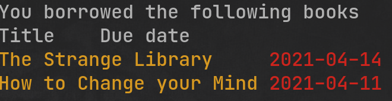

# libify
Print borrowed books from BC libraries. Optionally save due dates into your Google calendar

# Motivation
**Libify** is a fastest way to see all of your borrowed books with corresponding deadlines

## Usage
```
./libify show -p=password -u=user_id
```
1. `-p` - password which is usually last 4 numbers of your phone
2. `-u` - username ,you can check it in the front of your library card

# Example output



# Todo
1. [ ]  Add Vancouver Library support
2. [ ]  Add Google calendar intergration
3. [ ]  Allow to set Password and Username using Environment variables
